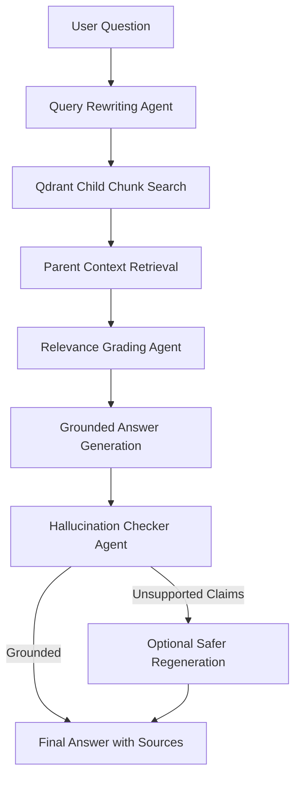

<div align="center">

# 🛡️ CyberGraph RAG

### Agentic Cybersecurity Knowledge Assistant

**CyberGraph RAG** is a full-stack Agentic Retrieval-Augmented Generation system designed for cybersecurity, cloud, AI, research, resume, and technical documents.

It combines document ingestion, DOCX/CSV/PDF parsing, parent-child chunking, vector search, local LLM inference, query rewriting, relevance grading, hallucination checking, document deletion, re-indexing, Docker support, and source-grounded answer generation.

<br/>


</div>

---

## 🚀 Overview

CyberGraph RAG is an **Agentic RAG assistant** that allows users to upload documents and ask grounded questions from those documents.

Unlike a basic RAG chatbot, this system does not simply retrieve chunks and generate an answer. It performs multiple reasoning and verification steps before producing the final response.

The system can:

- Upload and process PDF, TXT, Markdown, DOCX, and CSV files
- Convert PDFs into clean Markdown using `pymupdf4llm`
- Extract DOCX paragraphs and tables
- Convert CSV files into Markdown-style tabular context
- Split documents using parent-child chunking
- Store child chunks in Qdrant vector database
- Store parent chunks locally for richer answer context
- Retrieve larger parent contexts from small semantic matches
- Rewrite user questions into better search queries
- Grade retrieved context relevance
- Generate answers using a local Ollama LLM
- Check whether answers are supported by retrieved context
- Regenerate safer answers when unsupported claims are detected
- Delete documents and rebuild the vector index
- Re-index all remaining documents
- Run locally or with Docker Compose
- Display sources, relevance grades, and hallucination checks in Streamlit

---

## ✨ Key Features

| Feature | Description |
|---|---|
| 📄 Multi-format Upload | Supports PDF, TXT, Markdown, DOCX, and CSV files |
| 🧹 Text Cleaning | Removes noisy spaces, blank lines, and formatting issues |
| 📘 DOCX Parsing | Extracts paragraphs and tables from Word documents |
| 📊 CSV Parsing | Converts CSV rows and columns into Markdown table context |
| 🧩 Parent-Child Chunking | Uses small child chunks for search and large parent chunks for answer context |
| 🔎 Vector Search | Uses Qdrant with HuggingFace sentence-transformer embeddings |
| 🧠 Local LLM | Uses Ollama for local/offline answer generation |
| 🔁 Query Rewriting | Rewrites vague user questions into better retrieval queries |
| ✅ Relevance Grading | Filters or grades retrieved context before answer generation |
| 🛡️ Hallucination Checking | Checks if the answer is supported by retrieved documents |
| ♻️ Safer Regeneration | Regenerates answers when unsupported claims are detected |
| 🗑️ Document Deletion | Deletes uploaded file, Markdown file, and parent chunks |
| 🔄 Re-indexing | Rebuilds Qdrant vector DB from remaining Markdown documents |
| 🐳 Docker Support | Runs backend and frontend using Docker Compose |
| 🌐 FastAPI Backend | Provides clean REST API and Swagger documentation |
| 🎨 Streamlit Frontend | Provides an interactive UI for upload, chat, deletion, and re-indexing |
| 📈 LangGraph Workflow View | Visualizes the agentic RAG workflow |

---

## 🧠 Why This Project Matters

Most basic RAG systems follow this simple pipeline:

```text
User Question → Vector Search → LLM Answer
## 🧠 Why This Project Matters

Most basic RAG systems follow this simple pipeline:

```text
User Question → Vector Search → LLM Answer

User Question
      ↓
Query Rewriting Agent
      ↓
Vector Search on Child Chunks
      ↓
Parent Context Retrieval
      ↓
Document Relevance Grader
      ↓
Grounded Answer Generator
      ↓
Hallucination Checker
      ↓
Optional Safer Regeneration
      ↓
Final Answer with Sources

```

```markdown
## 🏗️ System Architecture

CyberGraph RAG
│
├── Document Ingestion
│   ├── PDF Upload
│   ├── TXT / Markdown Upload
│   ├── DOCX Upload
│   ├── CSV Upload
│   ├── PDF to Markdown Conversion
│   ├── DOCX Paragraph and Table Extraction
│   ├── CSV to Markdown Conversion
│   ├── Text Cleaning
│   └── Parent-Child Chunking
│
├── Storage Layer
│   ├── Uploaded Files
│   ├── Markdown Files
│   ├── Parent Chunks Stored Locally
│   └── Child Chunks Stored in Qdrant
│
├── Retrieval Layer
│   ├── Query Rewriting
│   ├── Child Chunk Vector Search
│   ├── Parent Context Loading
│   └── Context Formatting
│
├── Agentic Reasoning Layer
│   ├── Relevance Grading
│   ├── Grounded Answer Generation
│   ├── Hallucination Checking
│   └── Safer Answer Regeneration
│
├── Document Management
│   ├── List Documents
│   ├── Delete Documents
│   └── Re-index Remaining Documents
│
├── Backend
│   └── FastAPI REST API
│
└── Frontend
    └── Streamlit Web Interface
```

 ## 🧰 Tech Stack

| Layer            | Technology                        |
| ---------------- | --------------------------------- |
| Language         | Python                            |
| Backend          | FastAPI                           |
| Frontend         | Streamlit                         |
| Local LLM        | Ollama                            |
| LLM Model        | Qwen2.5 3B Instruct via Ollama    |
| Embeddings       | HuggingFace Sentence Transformers |
| Vector Database  | Qdrant Local                      |
| RAG Framework    | LangChain                         |
| Agent Workflow   | LangGraph-style agentic workflow  |
| PDF Parsing      | PyMuPDF / pymupdf4llm             |
| DOCX Parsing     | python-docx                       |
| CSV Parsing      | pandas                            |
| API Docs         | Swagger UI                        |
| Containerization | Docker and Docker Compose         |
| Environment      | Conda / venv / Docker             |


```markdown
## 📂 Project Structure

cybergraph-rag-assistant/
│
├── backend/
│   ├── app/
│   │   ├── api/
│   │   │   ├── chat.py
│   │   │   └── documents.py
│   │   │
│   │   ├── services/
│   │   │   ├── chat_service.py
│   │   │   ├── document_service.py
│   │   │   ├── hallucination_checker_service.py
│   │   │   ├── llm_service.py
│   │   │   ├── parent_store_service.py
│   │   │   ├── query_rewriter_service.py
│   │   │   ├── relevance_grader_service.py
│   │   │   ├── retrieval_service.py
│   │   │   └── vector_store_service.py
│   │   │
│   │   ├── utils/
│   │   │   ├── chunker.py
│   │   │   ├── file_loader.py
│   │   │   └── text_cleaner.py
│   │   │
│   │   ├── models/
│   │   │   └── schemas.py
│   │   │
│   │   ├── data/
│   │   │   ├── uploads/
│   │   │   ├── markdown/
│   │   │   ├── vector_db/
│   │   │   └── parent_store/
│   │   │
│   │   ├── config.py
│   │   └── main.py
│   │
│   ├── Dockerfile
│   ├── requirements.txt
│   └── requirements-docker.txt
│
├── frontend/
│   ├── streamlit_app.py
│   ├── Dockerfile
│   └── requirements-docker.txt
│
├── assets/
│   └── screenshots/
│
├── docker-compose.yml
├── .env.example
├── .gitignore
└── README.md

```
##📄 Supported File Types

| File Type | Support                                                  |
| --------- | -------------------------------------------------------- |
| PDF       | Extracted and converted to Markdown using `pymupdf4llm`  |
| TXT       | Loaded as plain text                                     |
| Markdown  | Loaded as plain text                                     |
| DOCX      | Paragraphs and tables converted into Markdown-style text |
| CSV       | First 200 rows converted into Markdown table context     |


##🔌 API Endpoints

Health

| Method | Endpoint  | Description          |
| ------ | --------- | -------------------- |
| GET    | `/health` | Check backend health |

Documents

| Method | Endpoint                    | Description                         |
| ------ | --------------------------- | ----------------------------------- |
| POST   | `/documents/upload`         | Upload and index a document         |
| GET    | `/documents/`               | List processed documents            |
| GET    | `/documents/parent-chunks`  | List stored parent chunks           |
| GET    | `/documents/search`         | Search child chunks                 |
| GET    | `/documents/retrieve`       | Retrieve parent contexts            |
| GET    | `/documents/context`        | Build final context text            |
| GET    | `/documents/vector-db/info` | Show Qdrant collection info         |
| DELETE | `/documents/{document_id}`  | Delete a document and rebuild index |
| POST   | `/documents/reindex`        | Rebuild full vector index           |

Chat

| Method | Endpoint | Description                      |
| ------ | -------- | -------------------------------- |
| POST   | `/chat/` | Ask a question using Agentic RAG |


## 🎯 Use Cases

CyberGraph RAG can be adapted for:

- Cybersecurity report Q&A
- Cloud documentation assistant
- Research paper assistant
- Resume and portfolio knowledge assistant
- Technical knowledge base search
- Security policy and compliance document review
- Internal enterprise documentation assistant
- SOC knowledge assistant
- Threat intelligence document assistant
- Academic paper summarization and Q&A
- Local private document chatbot

## 🧑‍💻 What I Built

This project demonstrates practical AI engineering skills:

- End-to-end RAG system design
- Backend API development with FastAPI
- Frontend development with Streamlit
- Local LLM integration using Ollama
- Vector database integration with Qdrant
- Embedding-based semantic search
- Parent-child retrieval architecture
- Agentic query rewriting
- LLM-based relevance grading
- Hallucination detection and safer regeneration
- Source-grounded answer generation

## 🔮 Future Improvements
The following features are planned for future improvement:

- User authentication
- Role-based document access
- Conversation memory
- Exportable chat history
- Hybrid dense + sparse retrieval
- RAG evaluation metrics
- Cloud deployment
- Better frontend design and UI polishing
- Admin dashboard for document management
- Multiple collection support
- Multi-user document separation
- Background document processing
- Upload progress tracking
- Better error handling in Streamlit
- Large file handling improvement
- API rate limiting
- Unit tests and integration tests
- CI/CD pipeline for GitHub
- Deployment guide for cloud platforms
- Support for additional file types such as XLSX and HTML
- Metadata-based filtering
- Source citation display in final answers
- Chat session management
- Persistent conversation database
- Production Qdrant server support instead of local Qdrant path mode

## Agentic Workflow Visualization


```
##📌 Current Completed Features

✅ Agentic RAG backend
✅ FastAPI REST API
✅ Streamlit frontend
✅ Local Ollama LLM integration
✅ Qdrant vector database
✅ Parent-child chunking
✅ Query rewriting
✅ Relevance grading
✅ Hallucination checking
✅ Safer answer regeneration
✅ LangGraph-style workflow visualization
✅ Docker and Docker Compose support
✅ Document deletion
✅ Full document re-indexing
✅ PDF support
✅ TXT support
✅ Markdown support
✅ DOCX support
✅ CSV support
```

<div align="center">
⭐ If you find this project useful, consider starring the repository.

CyberGraph RAG - Agentic AI for trusted technical knowledge retrieval

</div> 
